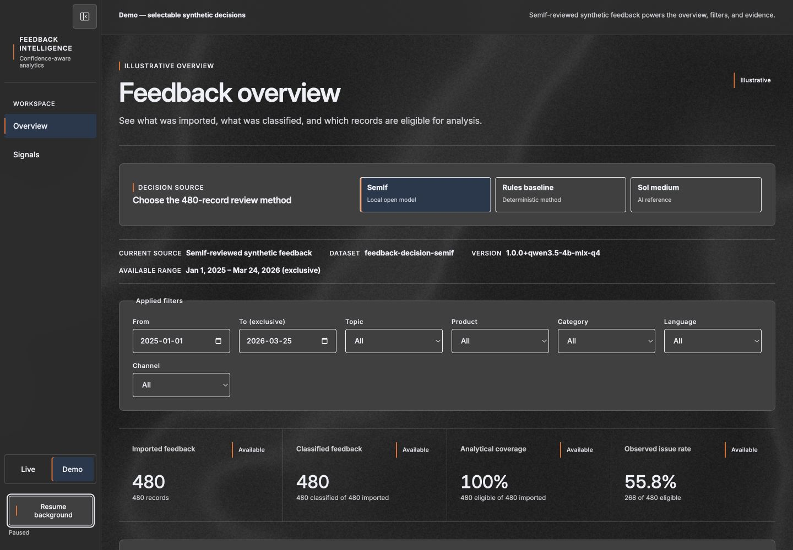
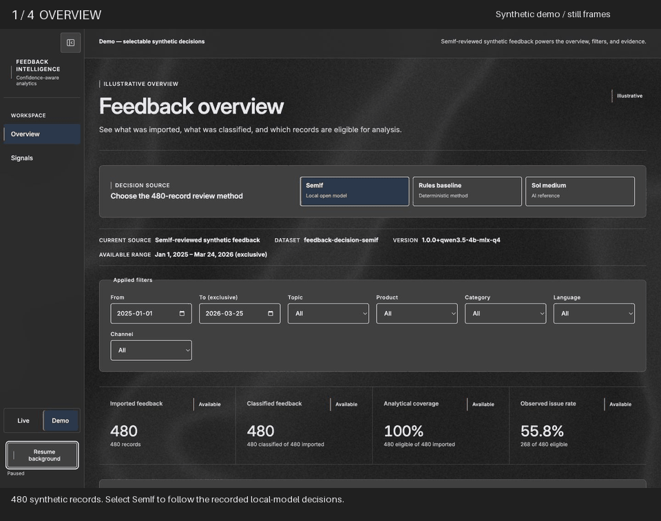
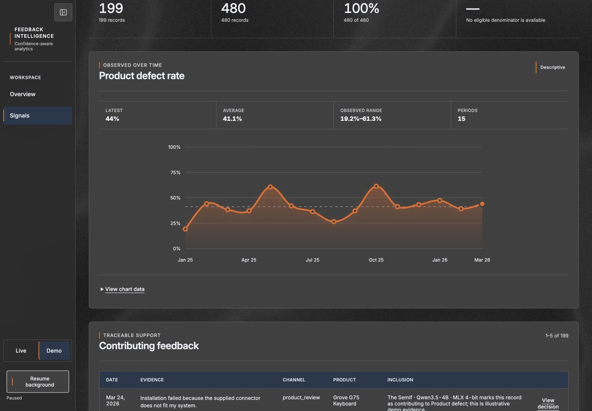
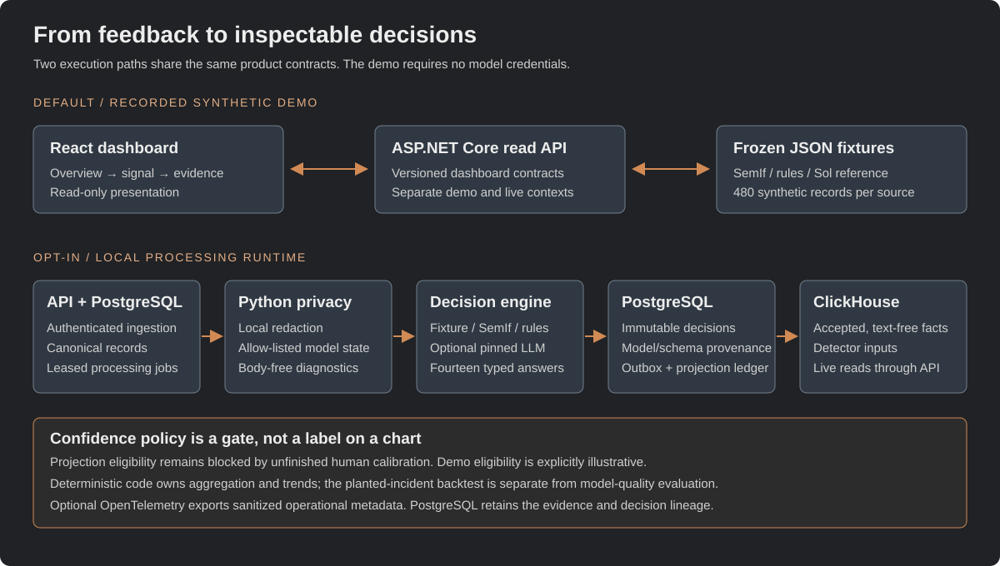

# Feedback Intelligence

**From customer feedback to evidence-backed signals.**

Classify feedback into typed decisions, inspect changes over time, and trace each
signal back to the records and model output behind it.



[Demo walkthrough](docs/demo-walkthrough.md) · [Architecture](docs/architecture.md) ·
[Benchmark](docs/benchmark.md) · [Model & limitations](MODEL_CARD.md) ·
[Release readiness](docs/release-readiness.md)

## Try it locally

With Docker Desktop running, run from the repository root:

```sh
docker compose up --build
```

Open [localhost:8080](http://localhost:8080), keep **Demo** selected, choose
**SemIf**, then follow **Product defect → Explore signal → View decision**.
No API key or external dataset is needed; the first build downloads dependencies.

The demo offers **480 synthetic records**, **three selectable decision sources**
(SemIf, rules, and Sol medium), English and Swedish feedback, and **15 monthly
periods**. These are alternative reviews of the same records, not 1,440 independent
observations. Live analytics remain gated by unfinished human calibration.

## Recorded comparison

<!-- benchmark:start -->
| Method | Successful / target | Topic accuracy | Topic macro-F1 | Provider cost |
| --- | ---: | ---: | ---: | ---: |
| SemIf · Qwen3.5-4B | 480 / 480 | 88.12% | 0.8333 | $0.00 |
| GPT-5.4 Mini (closed partial) | 192 / 480 | 84.90% | 0.7828 | $0.39 |
| Rules baseline | 480 / 480 | 99.79% | 0.9988 | $0.00 |

Agreement with the Sol-medium AI reference on synthetic feedback; **not human gold**. The 192-record LLM subset is not directly comparable to the complete 480-record runs. Rules benefit from template repetition. Local costs exclude hardware and electricity; OpenAI spend is owner-reported. The estimated full LLM run is $0.98, not additional measured spend.
<!-- benchmark:end -->

See the [generated benchmark](docs/benchmark.md) for provenance and the
[model card](MODEL_CARD.md) for intended use and limitations.

## Follow the evidence



A four-screen sequence from the running demo; this is a screenshot walkthrough,
not a live recording. The [static walkthrough](docs/demo-walkthrough.md) offers
the same content without animation.



The [short walkthrough](docs/demo-walkthrough.md) includes the evidence trace,
model comparison, and the distinction between descriptive demo charts and the
separate planted-incident detector evaluation.

Technology retail is an independent portfolio use case. This project is not
commissioned, sponsored, endorsed, or used by Inet.

## Project Status

**Read-only evidence journey on persistent workflow storage.** The React application
implements overview → signal explorer → contributing feedback → immutable decision
detail. The ASP.NET Core API exposes versioned read surfaces with isolated live
and illustrative-demo data sources. The Python package provides data adapters,
deterministic generation, local redaction, recorded/local SemIf engines, a pinned
structured-output LLM baseline, PostgreSQL jobs/outbox, and text-free ClickHouse
projection.

Decision-engine and trend-algorithm flags now use a versioned shared contract and
typed registries. Unknown implementations fail during configuration instead of
entering the workflow as doomed jobs.

Confidence thresholds remain uncalibrated. The current live fixture correctly has
processed records and zero eligible analytical facts, so the dashboard withholds
analytical percentages rather than presenting a misleading zero. The deterministic
7/28-day detector and a Beta-Binomial candidate are implemented and measured on the
same planted incidents. The promotion gate retains the simpler detector because the
candidate increases mean detection delay; live activation still requires a calibrated
confidence policy. The opt-in HTTP
ingestion path now creates idempotent PostgreSQL jobs consumed by a continuous
lease-based worker. No human-gold quality, calibrated
policy, statistical-significance, or real-traffic trend claim has been measured.
Provider billing figures are owner-reported totals, separate from adapter token
counters and estimates. An interim 480-record SemIf-versus-Sol agreement report is
available in demo mode and explicitly excluded from human-gold and calibration claims.
The descriptive demo can switch between three complete 480-record decision
sources: local SemIf, the deterministic rules baseline, and the Sol-medium AI reference.
Each preserves the original source dates and metadata for richer filtering,
evidence inspection, and 15 monthly trend periods.

## Architecture



| Component | Intended responsibility | Available now |
| --- | --- | --- |
| React + TypeScript + Vite | Presentation and evidence navigation | Dashboard, Signal Explorer, evidence/detail journey, explicit demo/live states |
| ASP.NET Core | Validation, ingestion, queries, workflow orchestration | Health, versioned dashboard reads, and opt-in idempotent feedback ingestion |
| Python worker | Dataset normalization, privacy boundary, decision adapters, policy, provenance, trend detection | Data/privacy/decision/evaluation/trend CLIs, simple-rate and Beta-Binomial detectors, persistent fixture pipeline, and continuous job/outbox consumer |
| PostgreSQL | Canonical records, decisions, jobs/outbox, review state | Versioned operational schema, leases, immutable runs, outbox and ledger |
| ClickHouse | Accepted signals and analytical aggregates | Text-free facts plus a retry-safe, provenance-partitioned daily detector-input view; uncalibrated signals are excluded |
| OpenTelemetry | Sanitised traces and low-cardinality operational metrics | Opt-in API/worker instrumentation, W3C trace propagation, and allow-listing Collector |

The planned decision layer keeps semantic model judgments behind a replaceable
provider interface. Code owns workflow, arithmetic, aggregation, and trend detection.
See [architecture](docs/architecture.md) and the [ADRs](docs/adr/README.md).

## Repository Structure

```text
apps/web/                    React application
services/api/                ASP.NET Core service and tests
services/decision-worker/    Python package and tests
contracts/{api,config,data,events,decisions,evaluation}/
schemas/feedback-decision/1.0.0/   Active fourteen-question decision manifest
schemas/aggregation-policy/1.0.0/  Uncalibrated policy framework
data/{demo,external,processed,synthetic,fixtures}/
evaluation/{datasets,annotation,benchmarks,reports}/
infra/{postgres,clickhouse,otel}/
docs/adr/                    Architecture decision records
scripts/                     Repository validation
.github/workflows/           CI checks and container builds
```

The internal project-planning source is intentionally excluded from repository
publication. Public architecture, decision, quality, and roadmap records are
maintained under the docs directory.

## Local Development

For native development, install Node.js 24 with npm, the .NET 10 SDK matching
[`global.json`](global.json), Python 3.13, and uv. Docker with Compose is optional
for native component checks and required for containers. Each component installs
independently; no database or provider key is needed.

Run these commands in separate terminals from the repository root:

```sh
# Web shell: http://localhost:5173
cd apps/web
npm ci
npm run dev
```

```sh
# API liveness: http://localhost:5080/health
dotnet run --project services/api/src/FeedbackIntelligence.Api --urls http://localhost:5080
```

```sh
# Worker readiness command; exits after reporting status
cd services/decision-worker
uv sync --locked
uv run --locked decision-worker
```

Full install/build/lint/typecheck/test commands are in [CONTRIBUTING.md](CONTRIBUTING.md)
and the component READMEs: [web](apps/web/README.md), [API](services/api/README.md),
[worker](services/decision-worker/README.md).

## Bring Your Own Feedback

The zero-configuration demo and every external adapter produce the same canonical
feedback contract. From `services/decision-worker`:

```sh
# Immediate local path
uv run --locked feedback-data validate synthetic
uv run --locked feedback-data profile synthetic

# Minimal custom CSV (no product/rating/language fields required)
uv run --locked feedback-data validate csv \
  --file ../../data/examples/custom-feedback.csv \
  --mapping ../../data/examples/custom-feedback.mapping.yaml

# Optional Olist reference dataset
uv run --locked feedback-data fetch olist
uv run --locked feedback-data validate olist
uv run --locked feedback-data profile olist
uv run --locked feedback-data import olist
```

Use `FEEDBACK_DATA_PROVIDER=olist` to make Olist the default, or use the `csv`
provider with a YAML mapping for your own flat export. Olist raw files and all
normalized imports remain local and Git-ignored. The adapter preserves original
Portuguese text, joins products and operational facts without duplicating reviews,
and records source checksum, license, attribution, and validation results.

See [dataset integration](docs/data-sources.md) for the field mapping, data levels,
privacy boundary, generic CSV workflow, and extension guide.

Generate the full reproducible synthetic corpus and prove it matches its seed:

```sh
uv run --locked feedback-synthetic generate
uv run --locked feedback-synthetic verify
uv run --locked feedback-data validate synthetic \
  --path ../../data/synthetic/generated/feedback.jsonl
```

The default seed writes 10,000 English and Swedish records over 450 days, covering
five feedback sources, twelve products, sixteen scenarios, and four planted change
events. Generator-only scenario and event attribution stays in a separate ignored
provenance sidecar and cannot enter the model-safe state.

Check the local privacy boundary without making an external call:

```sh
uv run --locked feedback-privacy synthetic
uv run --locked feedback-privacy olist --json
```

This transforms each canonical record into a separate model-safe state, reports
redaction counts, and rejects likely payment credentials. The command never prints
feedback bodies. See [privacy boundaries](docs/privacy.md) for the exact allow-list
and current detection limits.

Run all nine committed demo records through recorded SemIf outputs without a
credential or network call:

```sh
uv run --locked feedback-decisions synthetic --json
```

Local model mode is explicit and uses only the model-safe state:

```sh
cd services/decision-worker
uv sync --locked --extra semif
uv run --locked --extra semif feedback-decisions \
  synthetic --engine semif --limit 1 --force --json
cd ../..
```

See [decision engine](docs/decision-engine.md) for the fourteen-question schema,
recording provenance, and fixture refresh workflow.

To run the fixture-backed dashboard and API without provider credentials:

```sh
docker compose up --build
```

Open the dashboard at [localhost:8080](http://localhost:8080) and the API health
endpoint at [localhost:5080/health](http://localhost:5080/health). The default UI
context is persistently labelled `Demo — selectable synthetic decisions`; its
method control switches metrics, filters, monthly series, and drill-down between
the committed SemIf, rules, and Sol-medium 480-record fixtures without writing either
database. Sol remains explicitly marked as an AI reference and not human gold.
All published ports bind to loopback.

Optional profiles:

```sh
# Build and run the one-shot worker
docker compose --profile worker run --rm --build decision-worker

# Run the dataset CLI in the same image
docker compose --profile worker run --rm --entrypoint feedback-data \
  decision-worker profile synthetic

# Copy once, then set both database passwords locally before starting storage
test -f .env || cp .env.example .env
docker compose --profile storage up -d postgres clickhouse

# Upgrade an existing local storage volume before starting updated writers
docker compose --profile pipeline run --rm --build \
  --entrypoint feedback-storage pipeline-worker migrate --json

# Persist and project all nine recorded demo decisions; safe to repeat
docker compose --profile pipeline up --build \
  --abort-on-container-exit --exit-code-from pipeline-worker pipeline-worker

# Keep storage online and start the live read path after the fixture run
docker compose --profile storage up -d postgres clickhouse
docker compose up -d --build api web

# Private/local write path: set a non-empty key, then enable ingestion and the worker
INGESTION_ENABLED=true INGESTION_API_KEY='replace-locally' \
  docker compose --profile runtime up -d --build \
  postgres clickhouse api processing-worker

# Local debug telemetry: add the Collector and enable both OTLP exporters
OTEL_ENABLED=true INGESTION_ENABLED=true INGESTION_API_KEY='replace-locally' \
  docker compose --profile runtime --profile observability up -d --build \
  postgres clickhouse otel-collector api processing-worker

# Validate every profile without starting containers
docker compose --profile '*' config --quiet

# Stop containers; named database volumes are retained
docker compose --profile '*' down
```

An existing `.env` should be edited rather than overwritten. `.env.example` includes
decision settings. Fixture mode remains the default; a live call requires the
explicit `--engine semif` option and the optional `semif` dependency group.
The LLM comparison is separately opt-in with `--engine llm` and requires
`OPENAI_API_KEY`; its default model is the dated `gpt-5.4-mini-2026-03-17` snapshot.
Database password changes after initialization require updating the existing database
account; changing `.env` alone does not rotate stored credentials.

## Evaluation

The repository includes a deterministic 480-record annotation sample with separate
development, calibration, and locked-test splits and 120 blind second-pass records.
Its labels are intentionally empty, so it is not yet a gold dataset. A common typed
prediction contract and scorer are ready for every engine; they report quality,
calibration, selective coverage, language slices, operational measurements, and
failures. Confidence thresholds remain null until review is complete. See
[evaluation design](docs/evaluation.md).

The interim study compares recorded SemIf and rule predictions with a Sol-medium
AI reference. The GPT-5.4 Mini experiment is deliberately closed after 192 successful
records. The [generated benchmark](docs/benchmark.md) reports agreement and costs
from the frozen artifacts; it does not claim human-gold quality or calibrated
production readiness. Full per-question and language reports are available in
[evaluation reports](evaluation/reports/feedback-decision-1.0.0).

```sh
cd services/decision-worker
uv run --locked feedback-evaluation readiness --json
uv run --locked feedback-evaluation report --json
uv run --locked feedback-evaluation predict --engine rules \
  --dataset ../../evaluation/ai-reference/feedback-decision-1.0.0 \
  --output /tmp/rules.predictions.jsonl --force
cd ../..
```

The current contract check validates the active decision manifest, semantic question
invariants, and JSON Schema syntax, including data and decision contracts:

```sh
uv run --locked --script scripts/validate_contracts.py
```

Run both frozen detector-only back-tests and reproduce their comparison:

```sh
cd services/decision-worker
uv run --locked feedback-trends evaluate --algorithm simple_rate_change
uv run --locked feedback-trends evaluate --algorithm candidate_statistical
uv run --locked feedback-trends compare
cd ../..
```

At the frozen operating point, seed `20260919` detects all four planted incidents.
It produces 13 alert episodes, nine unmatched episodes, `1.0` incident recall,
`0.3077` episode precision, a 7.25-day mean delay, and `0.5409` false episodes per
100 evaluable series-days. The statistical candidate preserves `1.0` recall, raises
precision to `0.3636`, and reduces false episodes from nine to seven, but mean delay
increases from 7.25 to 8.0 days. The generated promotion decision therefore retains
`simple_rate_change`. See [trend evaluation](evaluation/trends/README.md).

It does not establish decision quality or cross-version compatibility.

## Privacy & Traceability

The data adapters mark every normalized record as `uninspected`; normalization is
not redaction. The worker now creates a separate `redacted` model state before an
external decision adapter.
Feedback bodies and secrets stay out of the implemented privacy audit payload.
Decision envelopes retain separate schema, requested/resolved model, input hash,
and source identities. Their policy is null until calibration establishes routing
thresholds. Real source data must remain local and may cross an external decision
boundary only through the model-safe state. The current regex baseline does not
establish that arbitrary private data is production-safe.

See [privacy boundaries](docs/privacy.md) and [security reporting](SECURITY.md).

## Roadmap

1. Complete human annotation and calibrate per-decision policies without inventing
   global thresholds.
2. Complete hosted-mode hardening with managed identity, separate LOGIN credentials,
   TLS termination, and retention automation. API-key protection, fixed-window
   ingestion limiting, privacy-filtered cross-service telemetry, and trace links
   are implemented for the local/private runtime.
3. Complete human-gold rule/SemIf/LLM scoring, then publish reviewed measured reports.
   The interim AI-reference study includes complete SemIf/rules runs and a deliberately
   closed 192-record LLM experiment.
4. Validate and activate live trend inputs only after policy calibration.

The current vertical slice stops before calibrated routing and accepted live
analytical facts. Product reads, deterministic trend detection, and the evaluated
statistical candidate are implemented, including an explicit unavailable live state
and reproducible detector promotion gate.

Dashboard contracts, metric semantics, privacy boundaries, and local commands are
documented in [dashboard read architecture](docs/dashboard-architecture.md). The
design/token mapping and exact partial native-Figma status are recorded in
[dashboard product design](docs/dashboard-design.md).

## Licensing

Source code, configuration, schemas, contracts, migrations, tests, and
infrastructure definitions are licensed under the
[Apache License 2.0](LICENSE). Original documentation and project-authored
synthetic content are licensed under
[Creative Commons Attribution 4.0](LICENSES/CC-BY-4.0.txt).

Read [LICENSE-SCOPE.md](LICENSE-SCOPE.md) for the exact boundary and attribution
format. External datasets, dependency code, provider-generated output, trademarks,
and internal planning material are not relicensed; their release constraints are
recorded in [THIRD_PARTY_NOTICES.md](THIRD_PARTY_NOTICES.md).
