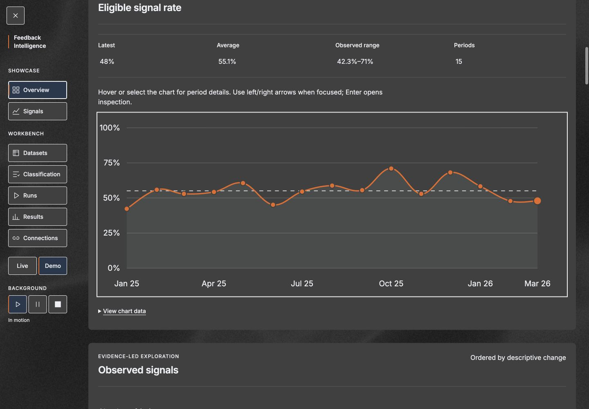
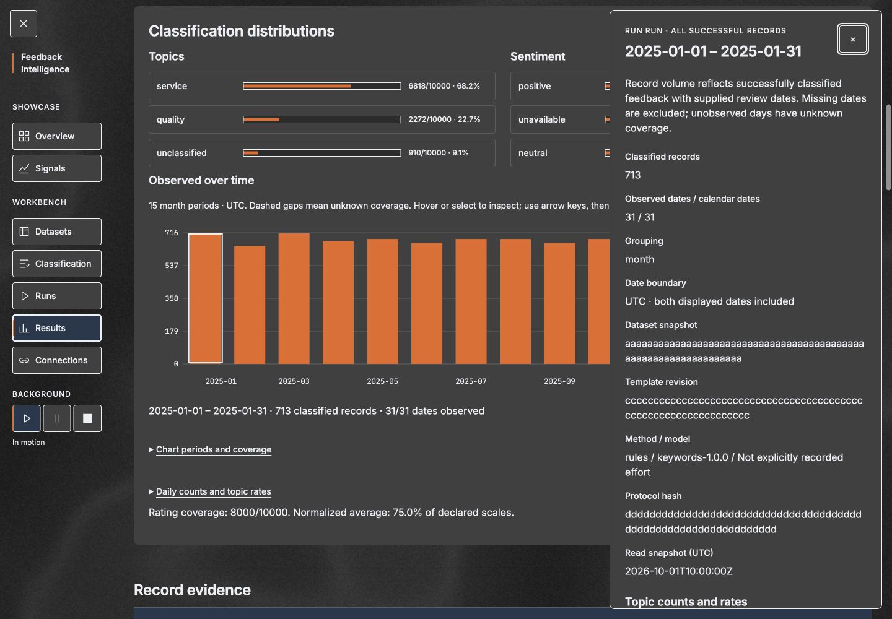
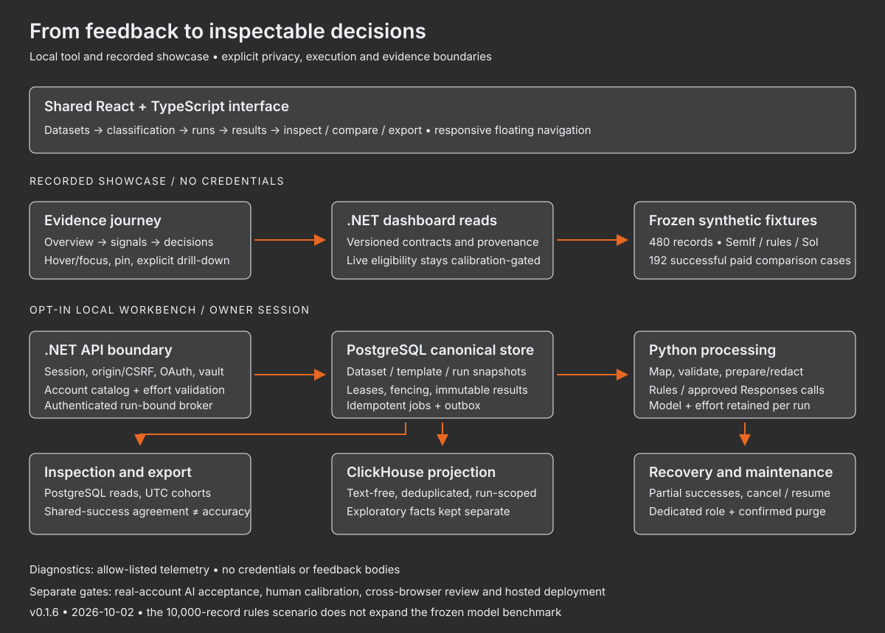

# Feedback Intelligence

**An interactive local feedback-classification tool and evidence-driven architecture showcase.**

Import reviews or comments, validate their structure, classify them with editable
keyword rules or an explicitly connected OpenAI account, and inspect the records
behind each distribution and trend. The recorded showcase remains available
without credentials.

Development checkpoint **v0.1.6**, toward v0.2.0. The published **v0.1.0** source
release remains unchanged. Local workflow safeguards are implemented and tested;
hosted multi-user operation and human-calibrated model quality remain later work.



[Interactive workbench guide](docs/workbench.md) · [Demo walkthrough](docs/demo-walkthrough.md) ·
[Architecture](docs/architecture.md) · [Benchmark](docs/benchmark.md) ·
[Model & limitations](MODEL_CARD.md) · [Release readiness](docs/release-readiness.md)

## Try it locally

With Docker Desktop running, start the interactive Workbench from the repository root:

```sh
python3 scripts/start_workbench.py
```

Open [localhost:8081/#workbench](http://localhost:8081/#workbench). Unlock it with
the private code in `.workbench-runtime/api/owner-code`. The startup script
provisions protected local configuration and isolated persistent storage; it does
not print credentials. No external model connection is required for rules.

For the original no-key recorded showcase:

```sh
docker compose up --build
```

Open [localhost:8080](http://localhost:8080), keep **Demo** selected and choose
SemIf, Rules baseline or Sol medium. The first build downloads dependencies.
The three methods review the same 480 synthetic records, not 1,440 independent
observations. English and Swedish records cover 15 monthly periods.

To add the reproducible larger rules scenario to the running Workbench:

```sh
python3 scripts/seed_workbench_demo.py
```

This scenario contains 10,000 records across 450 observed dates. It demonstrates
larger cohorts and filtering; it does not expand the frozen model benchmark.

## What you can do

| Area | Current capabilities | Availability and boundaries |
| --- | --- | --- |
| Showcase | Overview → Signal Explorer → contributing records → immutable decision evidence; selectable recorded methods and frozen evaluations | No credentials; synthetic data. Live analytical eligibility remains calibration-gated. |
| Datasets | CSV/TSV, XLSX, JSON arrays, JSONL and pasted lines; sheet selection, mapping, preview, validation and explicit import | Local owner session. Limits: 25 MiB, 10,000 records, 20,000 characters per text; no silent truncation. Missing dates remain missing. |
| Classification | General/retail templates, editable topics and keywords, immutable revisions, deterministic priority and match explanations | Free local rules. Built-in sentiment supports English/Swedish; unsupported languages return unavailable sentiment. |
| Connections | ChatGPT sign-in or separately selected API-key billing; account-specific model discovery and automatic refresh | GPT-6/GPT-6.1 and future models appear when listed for that account. Real-account classification verification remains pending. |
| Model controls | Model-specific reasoning effort, Provider default, supported Low/Medium/High/Extra high/Max and None where available | Capability-aware choices; unknown capabilities use provider defaults. No silent model or billing fallback. |
| Runs | Representative AI samples up to 25 records, explicit expansion, saved settings, durable partial results, cancel/resume and local history | AI requires connection, prepared-text preview and consent. Interrupted requests can consume additional usage when retried. |
| Results | Coverage, topic/sentiment distributions, ratings, UTC volume, exploratory trends, run-wide filter menus, missing-value filters and pagination | Descriptive/exploratory analysis; missing coverage is unknown. Imported language/product/group metadata is not automatically inferred. |
| Inspection | Hover/focus previews, pinned detail panels, phone sheets, explicit period/category drill-down and per-record provenance | Counts, denominators, rule matches, redactions and available metadata remain inspectable. |
| Comparison | Shared-successful-record agreement for compatible dataset/template/protocol snapshots; model and effort shown | Whole-run comparison, independent of Explore filters. Accuracy/F1 require reference labels; agreement is not accuracy. |
| Export & deletion | Filtered CSV/JSON with provenance; local dataset deletion with durable purge | Prepared text by default; original text requires confirmation. Deletion completes only after operational and analytical stores confirm purge. |

## A usable workflow

1. Open **Datasets** and upload/paste data. Map text and optional date, rating,
   language, channel, product/group and source ID fields; review errors and exclusions.
2. Open **Classification**, select a saved dataset and template revision, and run
   free keyword rules. Edit the template to create a new immutable revision.
3. Open **Results**. Hover or focus a metric/chart period, pin its details, then
   select **View matching records** to inspect its evidence. Apply observed-value
   filters and examine coverage before interpreting a rate.
4. Optionally connect OpenAI, choose an account-listed model and supported
   reasoning effort, review prepared text and approve a small sample. Expand only
   after inspecting the sample and confirming the remaining processing.
5. Compare compatible runs and export the selected cohort. Saved local history
   remains until deleted; keep source files and exports separately as backups.



## Architectural decisions demonstrated

The project makes semantic model output one replaceable step in a durable workflow.
Deterministic code owns validation, arithmetic, aggregation and statistical methods.
Its evidence views make classifications and failure boundaries reviewable.

| Component | Implemented responsibility |
| --- | --- |
| React + TypeScript | Shared responsive interface; mapping, configuration, inspection, evidence navigation and recovery states |
| ASP.NET Core | Public API boundary, local sessions, same-origin/CSRF checks, OAuth, encrypted credentials and authenticated credential broker |
| Python worker | Canonical imports, privacy preparation, rules/Responses adapters, leases, fencing, bounded retries and exploratory analysis |
| PostgreSQL | Canonical records, immutable dataset/template/run snapshots and decisions, job/outbox durability and scoped service principals |
| ClickHouse | Dedicated text-free, deduplicated analytical projections; exploratory Workbench results remain separate from calibrated live facts |
| OpenTelemetry | Opt-in allow-listed operational telemetry and cross-service trace propagation without feedback bodies or credentials |

Dataset/run scope prevents cross-cohort results from mixing. Idempotency and fencing
protect against duplicate commands and expired workers. Immutable outputs and saved
model/effort settings preserve provenance. A separate maintenance principal performs
purge while ordinary application roles retain immutable-decision protections.

Credentials remain server-side. External processing receives prepared approved
fields, with no model tools or executable actions. Regex redaction is a bounded
privacy layer, not a guarantee that arbitrary personal data is safe to send.



See [architecture](docs/architecture.md), [ADRs](docs/adr/README.md),
[privacy boundaries](docs/privacy.md) and [verification evidence](docs/quality/model-controls-review.md).

## Recorded comparison

<!-- benchmark:start -->
| Method | Successful / target | Topic accuracy | Topic macro-F1 | Provider cost |
| --- | ---: | ---: | ---: | ---: |
| SemIf · Qwen3.5-4B | 480 / 480 | 88.12% | 0.8333 | $0.00 |
| GPT-5.4 Mini (closed partial) | 192 / 480 | 84.90% | 0.7828 | $0.39 |
| Rules baseline | 480 / 480 | 99.79% | 0.9988 | $0.00 |

Agreement with the Sol-medium AI reference on synthetic feedback; **not human gold**. The 192-record LLM subset is not directly comparable to the complete 480-record runs. Rules benefit from template repetition. Local costs exclude hardware and electricity; OpenAI spend is owner-reported. The estimated full LLM run is $0.98, not additional measured spend.
<!-- benchmark:end -->

See the [generated benchmark](docs/benchmark.md) for provenance and the
[model card](MODEL_CARD.md) for intended use and limitations.

## Recorded evidence journey

The [walkthrough](docs/demo-walkthrough.md) shows the current Showcase and
Workbench interface. The historical [24-second still-frame sequence](docs/assets/demo.gif)
records the original synthetic showcase; it is not a live recording of the current UI.
Technology retail is an independent portfolio use case. This project is not
commissioned, sponsored, endorsed, or used by Inet.

## Repository Structure

```text
apps/web/                    React application
services/api/                ASP.NET Core service and tests
services/decision-worker/    Python package and tests
contracts/{api,config,data,events,decisions,evaluation}/
schemas/feedback-decision/1.0.0/   Active fourteen-question decision manifest
schemas/aggregation-policy/1.0.0/  Uncalibrated policy framework
data/{demo,external,processed,synthetic,fixtures}/
evaluation/{datasets,annotation,benchmarks,reports}/
infra/{postgres,clickhouse,otel}/
docs/adr/                    Architecture decision records
scripts/                     Repository validation
.github/workflows/           CI checks and container builds
```

The internal project-planning source is intentionally excluded from repository
publication. Public architecture, decision, quality, and roadmap records are
maintained under the docs directory.

## Local Development

For native development, install Node.js 24 with npm, the .NET 10 SDK matching
[`global.json`](global.json), Python 3.13, and uv. Docker with Compose is optional
for native component checks and required for containers. Each component installs
independently; no database or provider key is needed.

Run these commands in separate terminals from the repository root:

```sh
# Web shell: http://localhost:5173
cd apps/web
npm ci
npm run dev
```

```sh
# API liveness: http://localhost:5080/health
dotnet run --project services/api/src/FeedbackIntelligence.Api --urls http://localhost:5080
```

```sh
# Worker readiness command; exits after reporting status
cd services/decision-worker
uv sync --locked
uv run --locked decision-worker
```

Full install/build/lint/typecheck/test commands are in [CONTRIBUTING.md](CONTRIBUTING.md)
and the component READMEs: [web](apps/web/README.md), [API](services/api/README.md),
[worker](services/decision-worker/README.md).

## Bring Your Own Feedback

The zero-configuration demo and every external adapter produce the same canonical
feedback contract. From `services/decision-worker`:

```sh
# Immediate local path
uv run --locked feedback-data validate synthetic
uv run --locked feedback-data profile synthetic

# Minimal custom CSV (no product/rating/language fields required)
uv run --locked feedback-data validate csv \
  --file ../../data/examples/custom-feedback.csv \
  --mapping ../../data/examples/custom-feedback.mapping.yaml

# Optional Olist reference dataset
uv run --locked feedback-data fetch olist
uv run --locked feedback-data validate olist
uv run --locked feedback-data profile olist
uv run --locked feedback-data import olist
```

Use `FEEDBACK_DATA_PROVIDER=olist` to make Olist the default, or use the `csv`
provider with a YAML mapping for your own flat export. Olist raw files and all
normalized imports remain local and Git-ignored. The adapter preserves original
Portuguese text, joins products and operational facts without duplicating reviews,
and records source checksum, license, attribution, and validation results.

See [dataset integration](docs/data-sources.md) for the field mapping, data levels,
privacy boundary, generic CSV workflow, and extension guide.

Generate the full reproducible synthetic corpus and prove it matches its seed:

```sh
uv run --locked feedback-synthetic generate
uv run --locked feedback-synthetic verify
uv run --locked feedback-data validate synthetic \
  --path ../../data/synthetic/generated/feedback.jsonl
```

The default seed writes 10,000 English and Swedish records over 450 days, covering
five feedback sources, twelve products, sixteen scenarios, and four planted change
events. Generator-only scenario and event attribution stays in a separate ignored
provenance sidecar and cannot enter the model-safe state.

Check the local privacy boundary without making an external call:

```sh
uv run --locked feedback-privacy synthetic
uv run --locked feedback-privacy olist --json
```

This transforms each canonical record into a separate model-safe state, reports
redaction counts, and rejects likely payment credentials. The command never prints
feedback bodies. See [privacy boundaries](docs/privacy.md) for the exact allow-list
and current detection limits.

Run all nine committed demo records through recorded SemIf outputs without a
credential or network call:

```sh
uv run --locked feedback-decisions synthetic --json
```

Local model mode is explicit and uses only the model-safe state:

```sh
cd services/decision-worker
uv sync --locked --extra semif
uv run --locked --extra semif feedback-decisions \
  synthetic --engine semif --limit 1 --force --json
cd ../..
```

See [decision engine](docs/decision-engine.md) for the fourteen-question schema,
recording provenance, and fixture refresh workflow.

To run the fixture-backed dashboard and API without provider credentials:

```sh
docker compose up --build
```

Open the dashboard at [localhost:8080](http://localhost:8080) and the API health
endpoint at [localhost:5080/health](http://localhost:5080/health). The default UI
context is persistently labelled `Demo — selectable synthetic decisions`; its
method control switches metrics, filters, monthly series, and drill-down between
the committed SemIf, rules, and Sol-medium 480-record fixtures without writing either
database. Sol remains explicitly marked as an AI reference and not human gold.
All published ports bind to loopback.

Optional profiles:

```sh
# Build and run the one-shot worker
docker compose --profile worker run --rm --build decision-worker

# Run the dataset CLI in the same image
docker compose --profile worker run --rm --entrypoint feedback-data \
  decision-worker profile synthetic

# Copy once, then set both database passwords locally before starting storage
test -f .env || cp .env.example .env
docker compose --profile storage up -d postgres clickhouse

# Upgrade an existing local storage volume before starting updated writers
docker compose --profile pipeline run --rm --build \
  --entrypoint feedback-storage pipeline-worker migrate --json

# Persist and project all nine recorded demo decisions; safe to repeat
docker compose --profile pipeline up --build \
  --abort-on-container-exit --exit-code-from pipeline-worker pipeline-worker

# Keep storage online and start the live read path after the fixture run
docker compose --profile storage up -d postgres clickhouse
docker compose up -d --build api web

# Private/local write path: set a non-empty key, then enable ingestion and the worker
INGESTION_ENABLED=true INGESTION_API_KEY='replace-locally' \
  docker compose --profile runtime up -d --build \
  postgres clickhouse api processing-worker

# Local debug telemetry: add the Collector and enable both OTLP exporters
OTEL_ENABLED=true INGESTION_ENABLED=true INGESTION_API_KEY='replace-locally' \
  docker compose --profile runtime --profile observability up -d --build \
  postgres clickhouse otel-collector api processing-worker

# Validate every profile without starting containers
docker compose --profile '*' config --quiet

# Stop containers; named database volumes are retained
docker compose --profile '*' down
```

An existing `.env` should be edited rather than overwritten. `.env.example` includes
decision settings. Fixture mode remains the default; a live call requires the
explicit `--engine semif` option and the optional `semif` dependency group.
The LLM comparison is separately opt-in with `--engine llm` and requires
`OPENAI_API_KEY`; its default model is the dated `gpt-5.4-mini-2026-03-17` snapshot.
Database password changes after initialization require updating the existing database
account; changing `.env` alone does not rotate stored credentials.

## Evaluation

The repository includes a deterministic 480-record annotation sample with separate
development, calibration, and locked-test splits and 120 blind second-pass records.
Its labels are intentionally empty, so it is not yet a gold dataset. A common typed
prediction contract and scorer are ready for every engine; they report quality,
calibration, selective coverage, language slices, operational measurements, and
failures. Confidence thresholds remain null until review is complete. See
[evaluation design](docs/evaluation.md).

The interim study compares recorded SemIf and rule predictions with a Sol-medium
AI reference. The GPT-5.4 Mini experiment is deliberately closed after 192 successful
records. The [generated benchmark](docs/benchmark.md) reports agreement and costs
from the frozen artifacts; it does not claim human-gold quality or calibrated
production readiness. Full per-question and language reports are available in
[evaluation reports](evaluation/reports/feedback-decision-1.0.0).

```sh
cd services/decision-worker
uv run --locked feedback-evaluation readiness --json
uv run --locked feedback-evaluation report --json
uv run --locked feedback-evaluation predict --engine rules \
  --dataset ../../evaluation/ai-reference/feedback-decision-1.0.0 \
  --output /tmp/rules.predictions.jsonl --force
cd ../..
```

The current contract check validates the active decision manifest, semantic question
invariants, and JSON Schema syntax, including data and decision contracts:

```sh
uv run --locked --script scripts/validate_contracts.py
```

Run both frozen detector-only back-tests and reproduce their comparison:

```sh
cd services/decision-worker
uv run --locked feedback-trends evaluate --algorithm simple_rate_change
uv run --locked feedback-trends evaluate --algorithm candidate_statistical
uv run --locked feedback-trends compare
cd ../..
```

At the frozen operating point, seed `20260919` detects all four planted incidents.
It produces 13 alert episodes, nine unmatched episodes, `1.0` incident recall,
`0.3077` episode precision, a 7.25-day mean delay, and `0.5409` false episodes per
100 evaluable series-days. The statistical candidate preserves `1.0` recall, raises
precision to `0.3636`, and reduces false episodes from nine to seven, but mean delay
increases from 7.25 to 8.0 days. The generated promotion decision therefore retains
`simple_rate_change`. See [trend evaluation](evaluation/trends/README.md).

It does not establish decision quality or cross-version compatibility.

## Privacy & Traceability

The data adapters mark every normalized record as `uninspected`; normalization is
not redaction. The worker now creates a separate `redacted` model state before an
external decision adapter.
Feedback bodies and secrets stay out of the implemented privacy audit payload.
Decision envelopes retain separate schema, requested/resolved model, input hash,
and source identities. Their policy is null until calibration establishes routing
thresholds. Real source data must remain local and may cross an external decision
boundary only through the model-safe state. The current regex baseline does not
establish that arbitrary private data is production-safe.

See [privacy boundaries](docs/privacy.md) and [security reporting](SECURITY.md).

## Next milestones

1. Complete owner-initiated real ChatGPT sign-in/classification acceptance and
   broader browser/accessibility review; mocked CI does not establish provider admission.
2. Complete human annotation, adjudication, calibration and locked-test scoring.
   Keep exploratory AI-reference agreement separate from human-validated quality.
3. Evaluate hosted multi-user boundaries, deployment credentials, TLS, backups,
   retention and operational controls before public service deployment.
4. Promote live analytical eligibility only after calibrated policy acceptance.

The closed 192-record paid experiment stays closed. Source releases, local tool
functionality, model quality and hosted readiness have separate acceptance gates.
The shared interface and dated reviews are documented in
[interface design](docs/dashboard-design.md) and [release readiness](docs/release-readiness.md).

## Licensing

Source code, configuration, schemas, contracts, migrations, tests, and
infrastructure definitions are licensed under the
[Apache License 2.0](LICENSE). Original documentation and project-authored
synthetic content are licensed under
[Creative Commons Attribution 4.0](LICENSES/CC-BY-4.0.txt).

Read [LICENSE-SCOPE.md](LICENSE-SCOPE.md) for the exact boundary and attribution
format. External datasets, dependency code, provider-generated output, trademarks,
and internal planning material are not relicensed; their release constraints are
recorded in [THIRD_PARTY_NOTICES.md](THIRD_PARTY_NOTICES.md).
