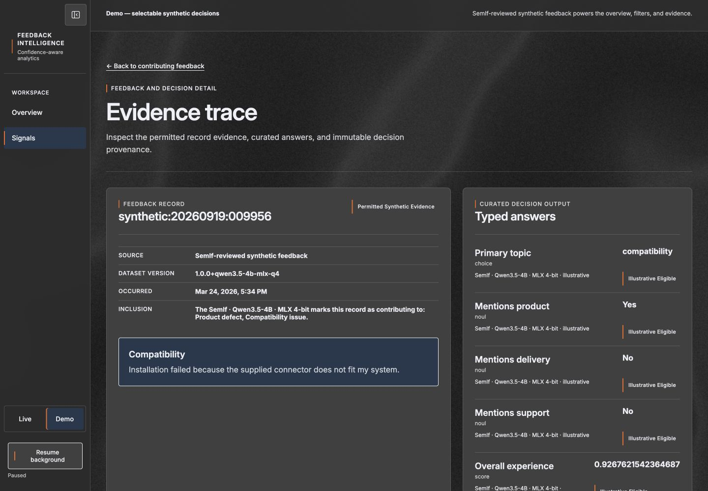
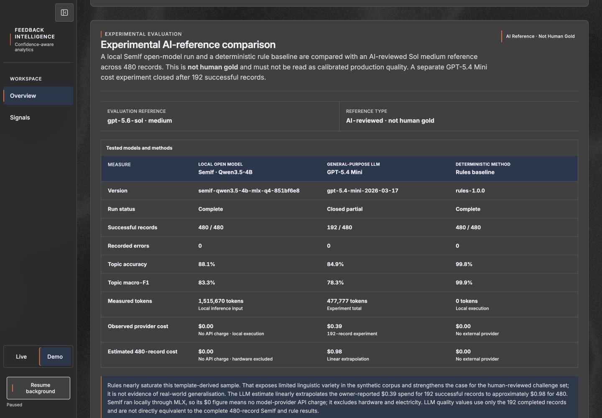
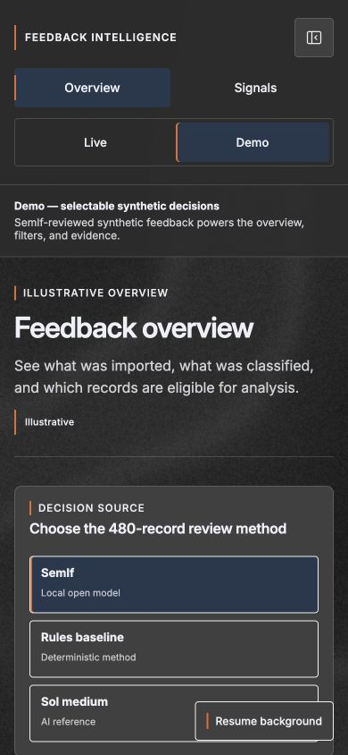

# A short tour of Feedback Intelligence

Start `docker compose up --build` from the repository root, then open
[localhost:8080](http://localhost:8080). No model credential is required.
All screenshots below show recorded synthetic SemIf decisions, not customer data.

1. Keep **Demo** selected and choose **SemIf**. The overview has 480 imported
   records. Compare the method choices to see how different decisions change the
   same population. The monthly chart is descriptive, not a detected incident.
2. Under **Observed signals**, select **Explore signal** on **Product defect**.
   Inspect its monthly rate, denominator, and contributing feedback. Narrow the
   language or product filter to change the population.
3. Select **View decision** for a contributing record. Read the original synthetic
   text, typed answers, and decision provenance. These make a model's questionable
   classifications inspectable as well as its correct ones.
4. Return to **Overview** and find **Experimental AI-reference comparison**.
   SemIf and rules cover 480 records; GPT-5.4 Mini covers only 192. The reference
   is AI reviewed and does not establish human-gold quality.

## Overview

## Signal explorer

## Evidence trace

Scroll below the typed answers for schema, model, policy, decision, and trace IDs.

## Recorded comparison

The [generated benchmark](benchmark.md) provides a readable alternative to the
screenshot and links to full-precision provenance.

## Phone layout

The navigation can collapse and reopen without changing the selected method.

## Capture notes

Captured from the local Docker demo on 2026-09-20 at the 1440 × 1000 desktop
breakpoint, with background motion paused. Screenshots are actual application
views, not mockups. The separate mobile check used a 390 × 844 viewport.
These captures cover the evidence journey; they are not a complete accessibility,
contrast, cross-browser, or production-readiness certification.
