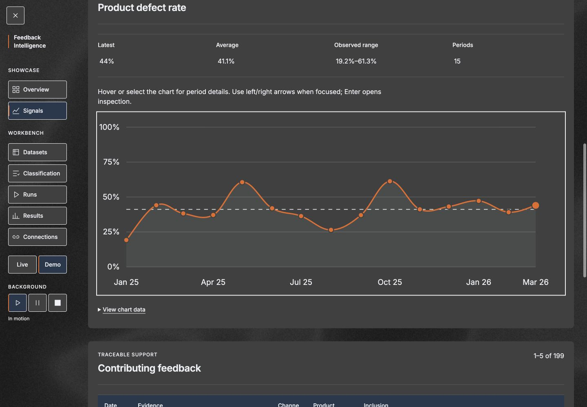
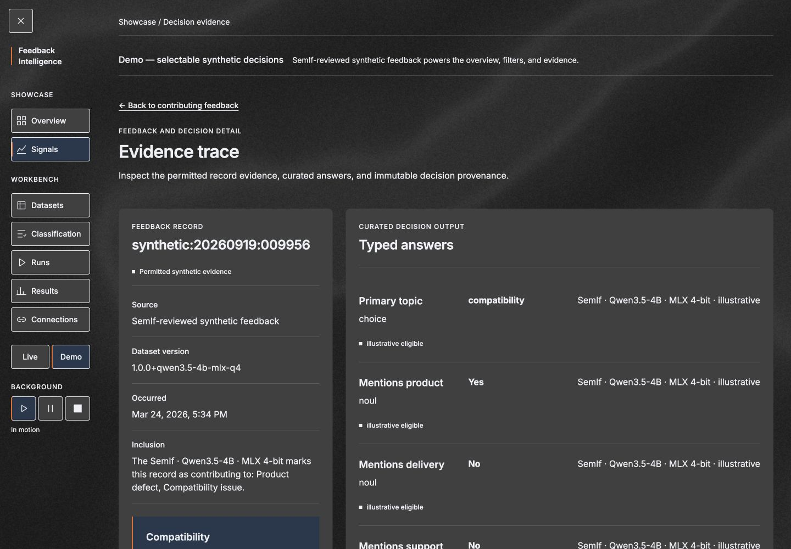
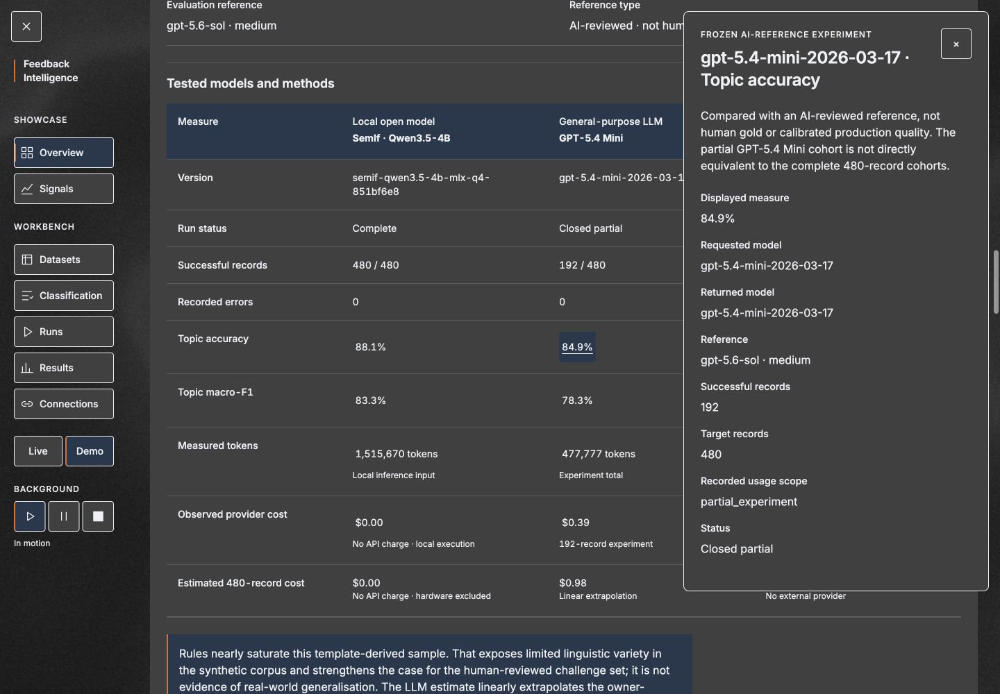
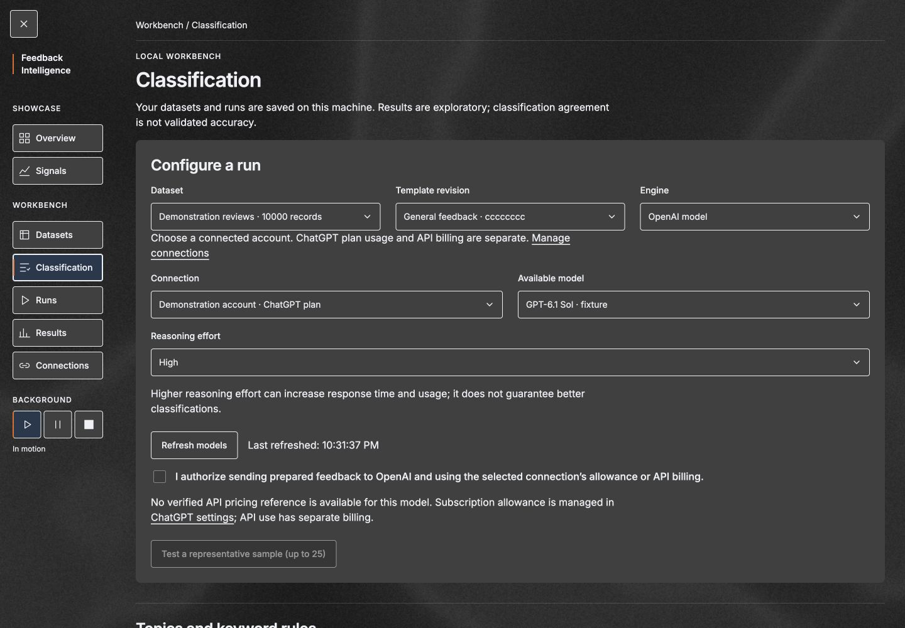
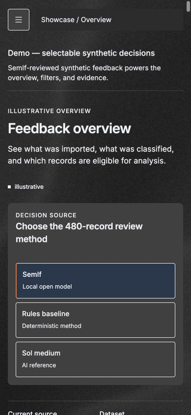

# A short tour of Feedback Intelligence

Two local entry points share the current Orbital Clarity interface:

- `docker compose up --build` → [localhost:8080](http://localhost:8080): the
  recorded no-key showcase.
- `python3 scripts/start_workbench.py` → [localhost:8081/#workbench](http://localhost:8081/#workbench):
  the interactive tool, unlocked using the protected local owner code.

## Recorded Showcase

1. Keep **Demo** selected and choose **SemIf**. The Overview contains 480 synthetic
   records. Rules and Sol medium are alternative decisions over the same population.
2. Hover or keyboard-focus a chart period, then select it to pin counts, denominator
   and provenance. **Apply period filter** narrows the existing date range.
3. Under **Observed signals**, choose **Explore signal** on **Product defect**.
   Inspect its monthly rate and contributing records; filters change the cohort.
4. Select **View decision** for a record. Read the synthetic text, fourteen typed
   answers and immutable decision provenance. Errors are inspectable too.
5. Return to Overview and inspect **Experimental AI-reference comparison**.
   SemIf/rules cover 480 records; GPT-5.4 Mini covers 192 successful records. The
   Sol reference is AI-reviewed, not human gold. The monthly chart is descriptive;
   the planted-incident detector backtest is a separate evaluation.

The [generated benchmark](benchmark.md) provides accessible tables and full
provenance independently of screenshots.

## Interactive Workbench

1. Open **Datasets**, upload/paste feedback, map columns and review validation plus
   prepared-text previews. Explicitly import valid rows after reviewing exclusions.
2. In **Classification**, select a dataset/template revision and run free rules.
   Editing topics, descriptions, keywords or priority creates a new revision.
3. Inspect **Results** through coverage, observed-value menus, date bounds,
   distributions and the calendar volume chart. Hover/focus previews; click/Enter
   pins details; **View matching records** opens the corresponding evidence cohort.
4. Use **Runs** for local history and execution state. Compare compatible snapshots
   over shared successfully processed records, independent of Explore filters.
5. Export all matching records as CSV/JSON with provenance. Prepared text is default;
   original text requires confirmation. Delete a dataset only when you intend to
   stop its work and purge its locally persisted data.

To reproduce the larger rules scenario in the actual installation, run
`python3 scripts/seed_workbench_demo.py`. The 10,000 records/450 dates do not
expand the frozen 480-record model benchmark.

## Optional model workflow

Connect ChatGPT or explicitly select separate API billing in **Connections**.
The account catalog refreshes automatically; eligible GPT-6/GPT-6.1 and future
models appear without a version whitelist. In Classification, choose the model
and its supported **Reasoning effort**, review prepared fields, then approve an
up-to-25-record sample. Inspect before explicitly expanding to remaining records.

The settings screenshot uses a deterministic mock connection and makes no external
request. Unknown effort capabilities use Provider default; available models and
plan access depend on the actual account. Two existing owner-created 25-record
ChatGPT samples completed for specific settings; no new paid run is part of the
v0.2.0 verification. This does not establish every catalog model. See the [Workbench guide](workbench.md) for persistence, billing,
privacy and interrupted-run boundaries.

## Phone layout

Open navigation on demand. Selection closes the menu; Escape returns focus.
Inspection uses a modal sheet on phones and a nonmodal side panel on desktop.

## Capture notes

The Workbench Results inspector image was refreshed on 2026-10-05 from the
development-only dense synthetic fixture at 1440 × 1000. Other images were
captured on 2026-10-02. Showcase images use the rebuilt local Docker application's
recorded synthetic SemIf decisions at 1440 × 1000, with a 390 × 844 phone capture.
Workbench images use the development-only deterministic 10,000-record Results
fixture and mock model catalog, not uploaded user data or measured provider output.
The interface is real React code, not a mockup. Captures establish presentation,
not cross-browser, assistive-technology, calibrated-quality or hosted readiness.

The [historical 24-second still-frame sequence](assets/demo.gif) remains from the
2026-09-20 interface; it is not a live recording or a current UI capture.
