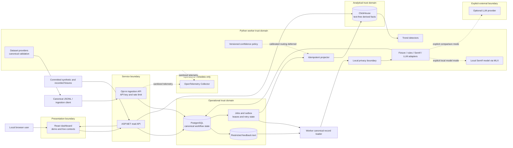

# Architecture responsibility and trust-boundary review

This review maps the repository's public architecture requirements to the current
implementation. It describes implemented source boundaries and known limits.
Source code is evidence that a mechanism exists; it is not proof that the
mechanism ran successfully in a particular environment. Execution evidence belongs
in the audit [verification report](verification-report.md), with final commands and
outcomes.

## Component and data flow

The default demo reads committed synthetic source metadata and recorded decision fixtures. It requires no provider credential and does not write either database. The live path is separate: ingestion writes canonical operational state and work identity to PostgreSQL; the worker claims a lease, constructs a model-safe state locally, runs a selected decision engine, persists an immutable decision and outbox event, and projects eligible derived facts to ClickHouse.

## Responsibility boundaries

| Boundary | Owns | Must not own or imply |
| --- | --- | --- |
| React/Vite | Presentation, filters, context switching, loading/error/empty states, evidence navigation | Model credentials, direct database access, classification or policy logic |
| ASP.NET Core | Versioned HTTP contracts, validation, opt-in ingestion, idempotency, job creation, operational/analytical read orchestration | Model prompts, long-running inference, raw analytical computation in the browser |
| Dataset providers | Source-specific parsing, provenance, canonical `feedback-record/1.0.0` output, validation reports | Redaction, semantic labels, or an assumption that normalized data is safe |
| Privacy boundary | Local deterministic transformation to `ModelSafeFeedbackState`, payment-data rejection, body-free audit representation | A guarantee that arbitrary private data has complete PII removal |
| Decision adapters | Typed semantic decisions through fixture, rules, pinned SemIf, or pinned LLM implementations | Workflow, date arithmetic, aggregation, trend detection, or silent model alias upgrades |
| Confidence policy | Per-question eligibility, abstention/review routing, policy provenance | Treating raw model probability as correctness or inventing a global threshold |
| PostgreSQL | Canonical metadata, restricted text, jobs, leases, immutable decisions/answers, reviews, outbox, projection ledger | Dashboard-scale time-series aggregation |
| Projector | At-least-once outbox consumption, stable projection identity, retry fencing, body-free analytical payloads | Cross-database exactly-once claims |
| ClickHouse | Append-oriented derived facts, deduplicated cohort views, daily analytical inputs | Canonical workflow state, raw feedback text, review mutation |
| Trend detectors | Deterministic rate/support/effect-size evaluation and the experimental Beta-Binomial candidate | Text interpretation or automatic promotion based on sophistication |
| OpenTelemetry | Allow-listed operational traces and low-cardinality metrics | Feedback bodies, credentials, provider payloads, or customer-content storage |

## Trust, evidence, and version axes

Canonical records remain `uninspected` after normalization. Original text stays in the restricted PostgreSQL relation. Only the worker constructs the redacted model state accepted by decision adapters; audit and telemetry forms omit both original and redacted bodies. SemIf is local and explicitly selected; the hosted LLM boundary is disabled unless explicitly selected and credentialed.

Operational and analytical stores answer different questions. PostgreSQL answers the state of a record and its workflow. ClickHouse answers what eligible derived signals do over time. Projection is at least once: PostgreSQL leases and a projection ledger fence ownership, stable event/projection identities support deduplicated reads, and analytical queries explicitly deduplicate rather than assuming background MergeTree replacement has completed.

Decision provenance keeps schema version, schema hash, requested model, resolved model, policy version, redacted-input hash, source identity, decision identity, and trace identity separate. The active decision manifest is `1.0.0`; evaluated SemIf fixtures pin the code, model revision, and MLX 4-bit configuration; the LLM comparison pins a dated model snapshot. Runtime engine and trend names pass through versioned configuration and typed registries. These controls support reproducibility but do not establish model quality.

The evidence journey is context-sensitive. Demo evidence is illustrative and derives from synthetic records plus recorded SemIf, deterministic-rule, and Sol AI-reference artifacts. Sol is not human gold. Live evidence returns decision metadata while withholding feedback bodies behind the restricted-text boundary. Dashboard rates use eligible denominators; zero eligible records produces an unavailable state rather than a misleading zero.

## Failure ownership

- The API rejects disabled, unauthorized, malformed, oversized, conflicting, or rate-limited ingestion before work is accepted.
- PostgreSQL owns durable job/outbox status, attempt limits, availability time, leases, lease tokens, and dead-letter state. A stale owner must not commit.
- The worker owns local redaction failures, provider failure classification, bounded job retries, immutable decision persistence, and safe error summaries.
- The projector owns replay-safe analytical writes and acknowledgement only after the analytical operation succeeds. PostgreSQL and ClickHouse do not form one atomic transaction.
- The read API owns structured unavailable/error responses. The web client owns request cancellation/ownership so a late response cannot replace a newer context.
- Frozen fixtures keep the local demo available when external model services are unavailable. They are evidence of recorded behavior, not a live-provider health check.

## Implemented gates and unresolved boundaries

Live analytical activation is deliberately closed. Human labels are empty, confidence thresholds are null, and uncalibrated decisions remain ineligible for aggregation. The frozen trend comparison uses one synthetic seed and operating point; the templates strongly reward lexical rules, so the result is not held-out or real-traffic evidence.

Compose binds published ports to loopback and protects ingestion with a server-side API key, but its services share development LOGIN credentials. Capability roles narrow database permissions; they are not separate hosted service principals. Dashboard reads, including live decision metadata, have no user authentication or evidence-authorization layer. There is no demonstrated hosted TLS, secret rotation, retention/deletion operation, incident process, or production observability backend.

The baseline executed web formatting/lint/types/build and 20 DOM/unit tests, the worker static checks and 95 tests, and an API Release build. Final repairs and checks are consolidated in `verification-report.md`; a passing source review or CI definition is not a remote CI run. The disposable SQL harnesses test real lease fencing, atomic rollback, permissions and analytical retry deduplication; the verification report records their boundaries. Legacy insert-driven rollups are not replay-safe and must not be used as authoritative metrics.

Rendered browser keyboard, responsive, focus, and visual checks were prohibited in
this audit and remain manual. Native Figma work is partial because the Figma
Starter-plan MCP quota blocked further authoring; the existing capture does not
prove browser correspondence. Apache-2.0 code and CC BY 4.0 authored-content
licensing are now explicit. Jev benchmark material was removed from the publication
candidate and replaced by the locally reproducible SemIf comparison.
